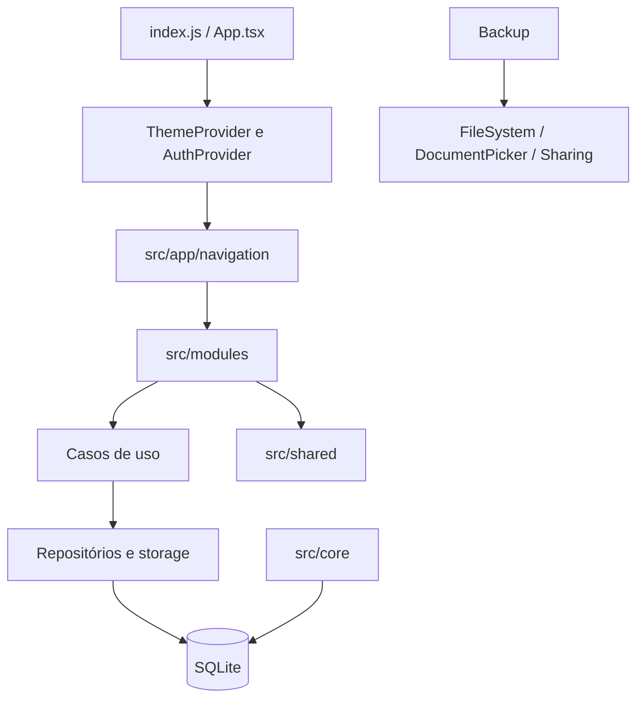

# Arquitetura atual

`app` compõe providers e navegação. `modules` contém fluxos de usuário, transações, relatórios e backup. `core` contém banco, migração e erros. `shared` contém componentes e tema.

As telas de transações usam casos de uso; o repositório SQLite concentra leitura e gravação. A camada de erros usa `AppError` e mensagens traduzidas na apresentação. Ainda há lógica de agregação nas telas e faltam testes de integração nativa.
