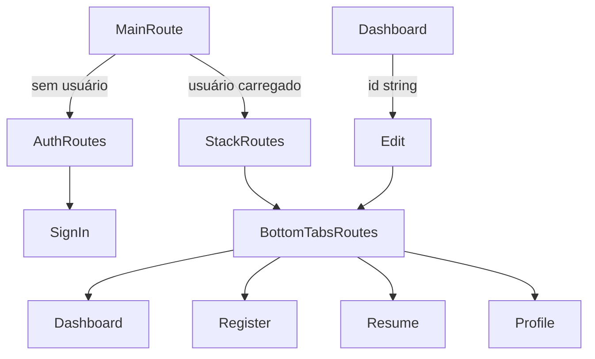

# Fluxo de navegação

`RootTabParamList` usa `Listagem`, `Cadastrar`, `Resumo` e `Perfil`, todos sem parâmetros. `AppStackParamList` usa `Home` sem parâmetros e `Edit` com `{ id: string }`. Os tipos são usados diretamente pelos navegadores.
