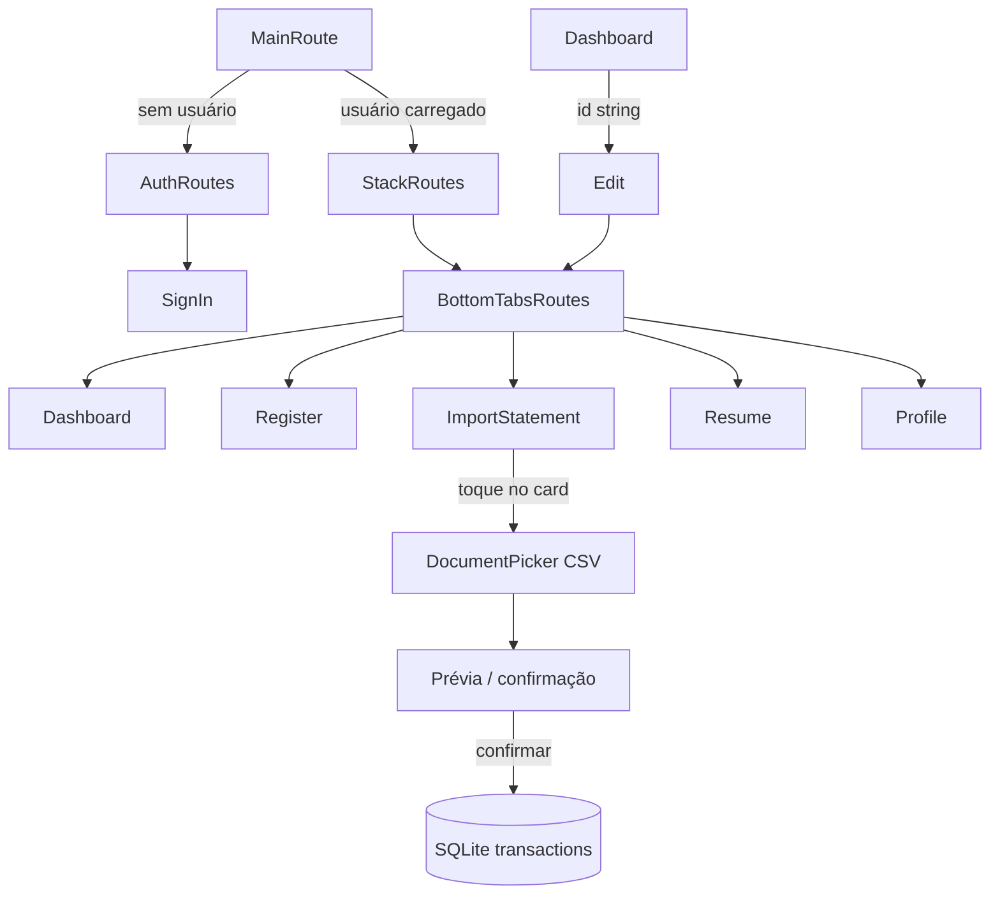

# Fluxo de navegação

`RootTabParamList` usa `Listagem`, `Cadastrar`, `Importar`, `Resumo` e `Perfil`, todos sem parâmetros. `AppStackParamList` usa `Home` sem parâmetros e `Edit` com `{ id: string }`. Os tipos são usados diretamente pelos navegadores.

A aba `Importar` e o fluxo de importação de extratos estão especificados em [`18-bank-statement-import-prompt.md`](18-bank-statement-import-prompt.md).
