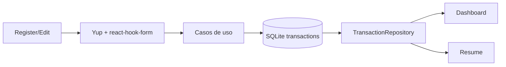

# Fluxo de dados

## Lançamentos

Valores e datas passam por regras de domínio tipadas. O parcelamento distribui centavos para preservar o total; datas inválidas são rejeitadas.

## Estado e erros

Estado de tela usa `useState` e recarrega com `useFocusEffect`. Usuário e tema são globais via Context API. Falhas usam `AppError`, são convertidas em mensagens seguras e exibidas pela tela responsável.

## Offline-first

SQLite é a fonte de verdade. Cadastro, edição, exclusão, consultas, tema, perfil e backup funcionam sem rede. Uma sincronização futura deverá ser opcional, assíncrona e nunca bloquear a confirmação local.
