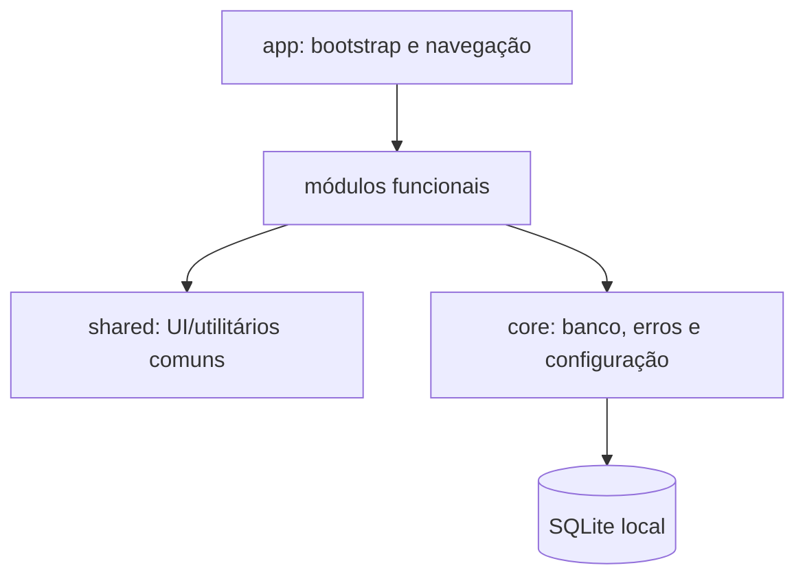

# Princípios de arquitetura

`app` compõe providers, navegação e inicialização. `modules` contém regras e casos de uso. `core` encapsula banco, migração, erros e integrações de infraestrutura. `shared` não depende de módulos.

O SQLite local é a fonte de verdade por causa do requisito offline-first. Uma integração remota futura deve ficar atrás de adaptador, ser opcional e usar outbox, idempotência e política de conflitos.
