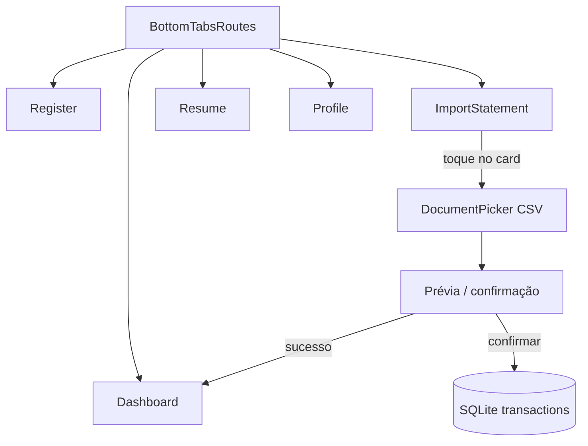

# Prompt de implementação: importação de extratos Nubank e PicPay

## Contexto do produto

O **Plutora** é um app mobile offline-first (Expo SDK 51, React Native 0.74.5) de controle financeiro pessoal. Os dados vivem em **SQLite local**; não há backend. Transações são criadas via casos de uso em `modules/transactions`, persistidas por `TransactionRepository`, e exibidas no Dashboard e no Resume.

Leia antes de implementar:

- `docs/04-functional-modules.md` — módulos e responsabilidades
- `docs/06-data-flow.md` — fluxo tela → caso de uso → SQLite
- `docs/11-proposed-architecture.md` — camadas e offline-first
- `docs/12-proposed-folder-structure.md` — onde colocar código novo
- `docs/14-development-conventions.md` — TypeScript, AppError, testes
- `docs/15-testing-strategy.md` — cobertura esperada
- `examples_extracts/` — extratos reais de referência (Nubank e PicPay)

## Objetivo

Implementar importação de extratos bancários em **CSV**, hoje para **Nubank** e **PicPay**, permitindo ao usuário selecionar um arquivo, visualizar uma prévia e importar **somente saídas** (`outcome`) como transações locais.

Cada transação importada deve carregar um **identificador de origem** que permita saber de qual banco/app veio o gasto e evitar duplicatas em reimportações.

## Regra de negócio principal

> **Importar apenas saídas. Nunca importar entradas**, seja Nubank ou PicPay.

### Nubank

Arquivo de referência: `examples_extracts/nubank/NU_379621784_01JUL2026_31JUL2026.csv`

- Delimitador: vírgula
- Cabeçalho: `Data,Valor,Identificador,Descrição`
- **Incluir** linhas em que `Valor` é numérico e **estritamente negativo**
- **Excluir** linhas em que `Valor` é positivo ou zero (entradas: transferências recebidas, resgates, créditos, etc.)
- `name` = coluna `Descrição` (trim)
- `date` = parse de `Data` (`DD/MM/YYYY`) via `parseTransactionDate`
- `externalId` = coluna `Identificador` (UUID do banco)
- `importSource` = `'nubank'`

### PicPay

Arquivo de referência: `examples_extracts/picpay/extrato-2026-07-01-2026-07-31.csv`

- Delimitador: vírgula (campos entre aspas)
- Cabeçalho: `data,hora,tipo,"origem / destino",valor,"forma de pagamento"`
- **Incluir** linhas em que `valor` contém prefixo de saída (`−R$` com U+2212 ou `-R$`)
- **Excluir** linhas com `+R$` (entradas: Pix recebido, dinheiro resgatado de cofrinho, etc.)
- **Excluir** tipos explicitamente de entrada quando o valor não for confiável: `Pix recebido`, `Dinheiro resgatado`
- `name` = `"{tipo} - {origem / destino}"` ou apenas `origem / destino` se tipo for redundante
- `date` = parse de `data` (`YYYY-MM-DD`)
- `externalId` = hash estável derivado de `data`, `hora`, `tipo`, `origem / destino`, `valor` normalizado (PicPay não expõe UUID no CSV)
- `importSource` = `'picpay'`

## Identificador de origem do gasto

Criar enum/tipo de domínio:

```ts
type ImportSource = 'nubank' | 'picpay'
```

Persistir em cada transação importada:

| Campo | Tipo | Descrição |
|---|---|---|
| `importSource` | `'nubank' \| 'picpay' \| null` | De onde veio o lançamento; `null` para cadastro manual |
| `externalId` | `string \| null` | ID do banco (Nubank) ou hash estável (PicPay) |

**Chave de deduplicação:** `(importSource, externalId)`. Se já existir transação com a mesma chave, **pular** na importação (não atualizar silenciosamente).

### Migração de schema

Estender a tabela `transactions` em `src/core/database/database.ts`:

- `import_source TEXT` (nullable)
- `external_id TEXT` (nullable)
- Índice único composto: `UNIQUE(import_source, external_id)` onde ambos não são nulos

Incrementar `SCHEMA_VERSION` e criar migração que adiciona colunas sem perder dados existentes (`import_source` e `external_id` = `NULL` para transações antigas).

Atualizar `TransactionDTO`, queries de insert/select em `saveTransactions` / `getAllTransactions`, e formato de backup em `backup-format.ts` para incluir os novos campos.

## Mapeamento para `TransactionDTO`

Cada linha importada vira **uma** transação:

| Campo Plutora | Valor na importação |
|---|---|
| `type` | `'outcome'` (sempre) |
| `value` | valor absoluto em **centavos** (inteiro), mesma convenção de `createTransactionPlan` |
| `amount` | `1` |
| `installmentNumber` / `installmentTotal` / `planId` | omitidos |
| `status` | `'paid'` (já ocorreu no extrato) |
| `category` | padrão `'other'` na v1; UI pode permitir categoria global antes de confirmar |
| `importSource` | `'nubank'` ou `'picpay'` |
| `externalId` | conforme regras acima |

**Conversão monetária:**

- Reutilizar `parseTransactionValue` de `transaction-money.ts` onde couber
- Nubank: `-3000.00` → `300000` centavos
- PicPay: `−R$ 36,96` → remover `R$`, tratar `−`, normalizar milhar e vírgula → centavos
- Usar `roundCurrency` antes de converter para centavos

**Conversão de data:**

- Reutilizar `parseTransactionDate` e `serializeTransactionDate` de `transaction-date.ts`

## Arquitetura sugerida

Seguir `docs/12-proposed-folder-structure.md`. Criar módulo `src/modules/statement-import/`:

```text
src/modules/statement-import/
├── domain/
│   ├── import-source.ts              # tipo ImportSource
│   ├── statement-entry.ts            # modelo normalizado pré-persistência
│   ├── detect-statement-provider.ts  # identifica nubank vs picpay pelo cabeçalho
│   ├── parse-nubank-statement.ts
│   ├── parse-picpay-statement.ts
│   ├── filter-outcomes-only.ts       # garante só saídas (defesa em profundidade)
│   └── deduplicate-import-entries.ts
├── application/
│   ├── parse-statement-file.ts       # orquestra detecção + parse
│   └── import-statement-entries.ts   # persiste via TransactionRepository
├── storage/
│   └── pick-statement-file.ts        # DocumentPicker + FileSystem (adaptador)
├── components/
│   └── BankImportCard/               # card reutilizável da lista de bancos
└── screens/
    └── ImportStatement/              # hub de bancos + prévia/confirmação
```

**Regras de camada:**

- Parsers e filtros ficam em `domain/` com funções puras e testáveis
- `application/` orquestra parse, deduplicação e persistência
- `storage/` encapsula `expo-document-picker` e leitura de arquivo (mesmo padrão de `restoreBackup.ts`)
- Telas só chamam casos de uso e exibem `getErrorMessage`

## Interface e experiência visual

### Nova aba na barra de navegação

Adicionar uma **quinta aba** dedicada à importação de extratos, independente do Perfil (onde ficam backup e restauração).

**Arquivo:** `src/app/navigation/app.routes.tsx`

| Propriedade | Valor |
|---|---|
| Rota | `Importar` |
| Componente | `ImportStatement` (tela hub de bancos) |
| Label no long-press | `Importar extrato` |
| Ícone da tab | `upload-file` (`MaterialIcons`) |

**Ícone da tab:** usar `upload-file`, que remete a envio/importação de arquivo CSV. Alternativa aceitável: `table-chart` (planilha). Manter o mesmo padrão das outras abas: componente `TabIcon` com animação de scale no foco, `tabBarShowLabel: false`, cores `theme.product.green_500` (ativo) e `theme.base.text` (inativo).

**Ordem sugerida das abas (esquerda → direita):**

1. Listagem (`format-list-bulleted`)
2. Cadastrar (`attach-money`)
3. **Importar (`upload-file`)** ← nova
4. Resumo (`pie-chart`)
5. Perfil (`person`)

Atualizar `RootTabParamList`:

```ts
export type RootTabParamList = {
    Listagem: undefined
    Cadastrar: undefined
    Importar: undefined
    Resumo: undefined
    Perfil: undefined
}
```

### Tela hub: lista de bancos (`ImportStatement`)

**Caminho:** `src/modules/statement-import/screens/ImportStatement/`

Tela inicial da aba **Importar**. Exibe uma lista de cards clicáveis — um por banco suportado. Ao tocar em um card, o usuário escolhe o CSV daquele banco e segue para prévia/confirmação da importação.

#### Estrutura visual (wireframe)

```text
┌─────────────────────────────────────┐
│  Header verde (#00875F)             │
│  "Importar extrato"                 │
├─────────────────────────────────────┤
│  padding 24px                       │
│                                     │
│  Texto introdutório (opcional)      │
│  "Selecione o banco de origem..."   │
│                                     │
│  ┌───────────────────────────────┐  │
│  │ [logo]  Nubank                │  │
│  │         Importe saídas do     │  │
│  │         extrato CSV da conta  │  │
│  └───────────────────────────────┘  │
│                                     │
│  ┌───────────────────────────────┐  │
│  │ [logo]  PicPay                │  │
│  │         Importe saídas do     │  │
│  │         extrato CSV do app    │  │
│  └───────────────────────────────┘  │
│                                     │
└─────────────────────────────────────┘
│  Tab bar (ícone upload-file ativo)  │
└─────────────────────────────────────┘
```

#### Header

Seguir o padrão de `Profile` e `Resume`:

- `background-color: theme.colors.primary` (`#00875F`)
- Altura ~`RFValue(96)` com `getStatusBarHeight()`
- Título centralizado: **"Importar extrato"**
- `font-family: theme.fonts.regular`, `font-size: RFValue(18)`, cor `theme.base.white`

#### Corpo

- `Container`: `flex: 1`, `background-color: theme.colors.background`
- `padding: 24px` (igual `Profile`/`Dashboard`)
- Texto introdutório opcional acima da lista:
  - `font-size: RFValue(14)`, `color: theme.colors.text`
  - Ex.: *"Selecione o banco de origem do arquivo CSV. Apenas saídas serão importadas."*

#### Card de banco (`BankImportCard`)

Lista em `FlatList` (ou map estático na v1 com 2 itens). Cada item é um card tocável, inspirado em `TransactionCard`:

| Propriedade | Especificação |
|---|---|
| Container | `TouchableOpacity`, `background-color: theme.colors.shape`, `padding: 18px 24px`, `margin-bottom: 16px` |
| Layout interno | `flex-direction: row`, `align-items: center` |
| Ícone à esquerda | Logo do banco em container arredondado |
| Área de texto | `flex: 1`, `margin-left: 16px` |
| Título | Nome do banco — `theme.fonts.medium`, `RFValue(16)`, `theme.colors.title` |
| Subtítulo | Descrição curta — `theme.fonts.regular`, `RFValue(12)`, `theme.colors.text`, `margin-top: 4px` |
| Feedback de toque | `activeOpacity: 0.7` (mesmo padrão das tabs) |
| Indicador à direita | `Feather` `chevron-right`, `RFValue(20)`, `theme.colors.text` (opcional) |

**Container do ícone do banco:**

- Tamanho: `RFValue(48)` × `RFValue(48)`
- `border-radius: RFValue(12)`
- `background-color: theme.colors.avatar_bg` (`shape_secondary`)
- Logo centralizada com `resizeMode: contain`
- Padding interno: `8px`

**Assets de logo (criar):**

```text
src/assets/banks/
├── nubank.png   (ou .svg)
└── picpay.png   (ou .svg)
```

Se SVG, seguir o padrão do projeto (`react-native-svg-transformer`). Enquanto os logos não existirem, usar placeholder com iniciais (`NU`, `PP`) em `theme.colors.avatar_text`.

#### Dados estáticos dos cards (v1)

```ts
const bankProviders = [
  {
    id: 'nubank',
    name: 'Nubank',
    subtitle: 'Importe apenas as saídas do extrato CSV da sua conta.',
    logo: require('../../../../assets/banks/nubank.png'),
    importSource: 'nubank' as const,
  },
  {
    id: 'picpay',
    name: 'PicPay',
    subtitle: 'Importe apenas as saídas do extrato CSV do aplicativo.',
    logo: require('../../../../assets/banks/picpay.png'),
    importSource: 'picpay' as const,
  },
]
```

#### Comportamento ao tocar no card

1. Abrir `DocumentPicker` filtrando CSV (`text/csv`, `text/comma-separated-values`)
2. Validar que o cabeçalho corresponde ao banco selecionado (Nubank ≠ PicPay)
3. Se arquivo de outro banco: alerta amigável — *"Este arquivo não parece ser um extrato {banco}. Selecione o banco correto ou outro arquivo."*
4. Se válido: exibir prévia ou modal de confirmação com resumo (importadas / ignoradas / duplicadas)

#### Estados da tela

| Estado | Visual |
|---|---|
| Idle | Lista de cards |
| Carregando arquivo | `ActivityIndicator` centralizado ou overlay no card tocado |
| Erro de leitura/parse | `Alert` com `getErrorMessage` |
| Sucesso | `Alert` com contagem; opcional navegar para Listagem |

#### Animação de entrada (opcional, recomendado)

Reutilizar o padrão de `AnimatedTransactionCard` no `Dashboard`: fade + `translateY` com delay escalonado por índice do card (`45ms` por item, máx. `300ms`).

#### Tema claro/escuro

Todos os tokens devem vir de `theme.colors` e `theme.base` — **não** usar cores fixas exceto nos logos oficiais dos bancos. Cards, header e tipografia devem funcionar em light e dark mode como as demais telas.

#### Acessibilidade

- `accessibilityRole="button"` em cada card
- `accessibilityLabel`: `"Importar extrato do {nome do banco}"`
- `accessibilityHint`: subtítulo do card

### Fluxo de navegação atualizado



### Arquivos de UI a criar/alterar

| Arquivo | Ação |
|---|---|
| `src/app/navigation/app.routes.tsx` | Nova tab `Importar` com ícone `upload-file` |
| `src/modules/statement-import/screens/ImportStatement/index.tsx` | Tela hub |
| `src/modules/statement-import/screens/ImportStatement/styles.ts` | Estilos styled-components |
| `src/modules/statement-import/components/BankImportCard/` | Card reutilizável |
| `src/assets/banks/nubank.png` | Logo Nubank |
| `src/assets/banks/picpay.png` | Logo PicPay |
| `docs/05-navigation-flow.md` | Atualizar diagrama |

## Fluxo do usuário (v1)

1. Usuário acessa a aba **Importar** na bottom bar
2. Vê a lista de bancos (Nubank e PicPay) e toca no card desejado
3. `DocumentPicker` abre para selecionar o CSV
4. App detecta e valida o provedor pelo cabeçalho
5. Parse retorna lista de entradas candidatas + estatísticas:
   - total de linhas no arquivo
   - entradas ignoradas (receitas)
   - saídas elegíveis
   - duplicatas já existentes (por `importSource` + `externalId`)
6. Usuário confirma importação na prévia
7. Caso de uso persiste apenas saídas novas em lote via `TransactionRepository`
8. Feedback: *"X transações importadas, Y ignoradas (entradas), Z duplicadas"*

## Tratamento de erros

Adicionar códigos em `AppErrorCode`:

- `STATEMENT_FILE_READ_FAILED`
- `STATEMENT_UNSUPPORTED_FORMAT`
- `STATEMENT_PARSE_FAILED`
- `STATEMENT_IMPORT_FAILED`

Mensagens amigáveis em `getErrorMessage`. Não logar conteúdo do extrato nem dados pessoais.

## Testes obrigatórios (Jest)

Usar os arquivos em `examples_extracts/` como fixtures:

1. **Nubank:** importa apenas linhas com `Valor < 0`; ignora transferências recebidas e resgates
2. **PicPay:** importa apenas linhas com `−R$`; ignora `+R$`, Pix recebido e resgates de cofrinho
3. **Detecção de provedor** pelo cabeçalho
4. **Conversão monetária** PicPay (`−R$ 2.110,24` → `211024` centavos)
5. **Deduplicação** — segunda importação do mesmo arquivo não duplica
6. **Origem** — toda transação importada tem `importSource` preenchido
7. Arquivo inválido / cabeçalho desconhecido → `STATEMENT_UNSUPPORTED_FORMAT`

Rodar também `npx tsc --noEmit` e `npm test` antes de concluir.

## Fora de escopo (v1)

- Importar entradas (`income`)
- Categorização automática por descrição
- OFX, PDF ou outros bancos
- Edição em lote pós-importação
- Sincronização remota
- Web como plataforma alvo
- Badge de origem no Dashboard (planejado para v2)

## Critérios de aceite

### Técnico

- [ ] CSV Nubank de `examples_extracts/nubank/` importa somente saídas
- [ ] CSV PicPay de `examples_extracts/picpay/` importa somente saídas
- [ ] Cada transação importada tem `importSource` (`nubank` ou `picpay`) e `externalId`
- [ ] Reimportar o mesmo arquivo não cria duplicatas
- [ ] Transações manuais existentes não são alteradas
- [ ] Funciona offline (sem rede)
- [ ] Testes unitários cobrem parsers e filtro de saídas
- [ ] Backup/restauração preserva `importSource` e `externalId`

### Interface

- [ ] Nova aba **Importar** visível na bottom bar com ícone `upload-file`
- [ ] Tela exibe cards de **Nubank** e **PicPay** com logo à esquerda, nome e subtítulo
- [ ] Visual consistente com `TransactionCard`, `Profile` e tema claro/escuro
- [ ] Toque no card abre seletor de CSV e valida banco correspondente
- [ ] Prévia exibe contagem de importadas, ignoradas e duplicadas antes de confirmar
- [ ] Mensagens de erro/sucesso usam `getErrorMessage` / `Alert`, sem dados pessoais do extrato

## Pontos para refinar depois (v2)

- Categoria padrão configurável ou sugestão por palavras-chave na descrição
- Filtro de transferências entre contas próprias (ex.: Pix para si mesmo)
- Exibir badge "Nubank" / "PicPay" no Dashboard
- Importação parcial por período
- Suporte a novos bancos via registry de parsers
- Tratar `Aplicação RDB` e investimentos como categoria `investments` em vez de gasto comum

## Prompt para o agente implementador

```
Implemente a importação de extratos CSV do Nubank e PicPay no Plutora conforme docs/18-bank-statement-import-prompt.md.

Requisitos inegociáveis:
1. Importar SOMENTE saídas (outcome); nunca entradas.
2. Persistir importSource ('nubank' | 'picpay') e externalId em cada transação importada.
3. Deduplicar por (importSource, externalId).
4. Seguir arquitetura offline-first: casos de uso fora das telas, parsers em domain/, DocumentPicker em storage/.
5. Usar examples_extracts/ como fixtures de teste.
6. Valores em centavos, status 'paid', type 'outcome', category padrão 'other'.
7. Não logar dados pessoais do extrato.
8. Nova aba Importar na bottom bar com ícone upload-file e tela hub com cards Nubank/PicPay.

Comece lendo docs/04, 06, 11, 12, 14 e os CSVs em examples_extracts/. Implemente migração SQLite, parsers, caso de uso, testes, UI da aba Importar e fluxo de prévia/confirmação.
```
